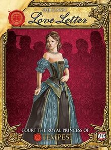

# Тайное послание



Текстовая игра _"Любовное послание"_ в виде бота для телеграма выполненного на python3.7.

## Установка и запуск
#### Установка

```$ pip install loveletter```

#### Запуск

Для того чтобы запустить бота требуется установить [телеграм](https://telegram.org/) и завести себе бота. Для этого достаточно написать в телеграм [@botfather](https://t.me/BotFather), он расскажет, что делать дальше, а в конце выдаст токен вашего бота (он выглядит примерно так `123456789:AAEaEMQlkqjLFEjklajklhCEWOHucAcidOH`).

Имея токен можно легко запустить бота:

```$ loveletter --token='<token>'```

Если не хочестся каждый раз вводить токен руками или искать откуда его скопипастить, то также можно сохранить его в системе, в переменной окружения:

```$ export LOVELETTER_TOKEN='<token>'```

Тогда бота запускать будет значительно легче :)

```$ loveletter```

Можно также вообще ничего не устанавливать, а воспользоваться готовым ботом [@loveletter_gamebot](https://t.me/loveletter_gamebot) который принадлежит автору этого репозитория. Впрочем автор не дает никаких гарантий, что бот будет в рабочем состоянии, когда вам захочется поиграть, поэтому, он постарался сделать так что деплой бота на произвольный компьютер, подключенный к интернету будет максимально прост.

## Правила игры

#### Колода
Это карточная игра в которой используется всего 8 карт:
* (8) Принцесса x1
* (7) Графиня x1
* (6) Король x1
* (5) Принц x2
* (4) Служанка x2
* (3) Барон x2
* (2) Священник x2
* (1) Стражница x5

Слева от карт указана их ценность, чем она больше &mdash;
тем больше шансов выиграть в конце раунда, так как из всех оставшихся игроков выигрывает тот,
у кого карта самая ценная. 
Справа указано число карт в стандартной колоде (всего их 16).

#### Начало игры
В начале игры карты перемешиваются,
и одна карта откладывается в сторону &mdash; 
она не будет участвовать в игре 
(так всегда остается интрига, какие карты остались в колоде), 
остальные карты расдаются игрокам по одной штуке, 
определяется порядок ходов и тот кто ходит берет себе еще одну карту.

Дальше игрок может выбрать какую из двух карт использовать. 
При этом несыгранная карта остается у него на руке, 
а сыгранная уходит в сброс, и применяется свойство этой карты.

#### Свойства карт
Ниже перечисленны свойства карт:
* **Принцесса** &mdash; если скинуть эту карту с руки, игрок моментально выбывает из игры.
При этом не важно скинул он ее сам, или же ему пришлось это сделать в результате действий
других игроков и их карт. С одной стороны эту карту очень опасно держать на руках, но если
удержать ее до конца раунда, обладатель этой карты становится безусловным победителем.
* **Графиня** &mdash; эту карту можно только скинуть с рук. Более того, если у игрока на руках второй картой 
оказывается **Король** или **Принц**, то игрок обязан играть **Графиней**. Учитывая что **Принцессу** он тоже не может скинуть
(если не хочет проиграть конечно), то **Графиня** это хороший индикатор того что у игрока на руке остается ценная карта (впрочем никто не запрещает блефовать и скидывать графиню с мелкими картами на руке).
* **Король** &mdash; скинув карту выберите другого игрока и обменяйтесь с ним картами, которые у вас на руках.
* **Принц** &mdash; выберите любого игрока (можно себя), он должен скинуть свою карту с руки и взять другую. Если у него была **Принцесса**, то он моментально проиграл, а если карт в колоде нет, то игрок берет ту которая была отложена в начале игры.
* **Служанка** &mdash; сыграв эту карту, игрок становится полностью защищенным от эффектов других карт. Иногда бывает так что все игроки защищены служанкой, а кто то хочет применить карту требующую выбора игрока, тогда он применяет ее на себя (по умолчанию на себя можно применять только карту **Принца**)
* **Барон** &mdash; сыграв барона выберите игрока, и сравните ваши с ним карты на руках. Тот у кого карта слабее &mdash; выходит из игры. Если же карты одинаковые, ничего не происходит, **Барон** уходит впустую.
* **Священник** &mdash; скинув карту игрок может посмотреть карту любого другого игрока, при этом она не раскрывается всем остальным игрокам.
* **Стражница** &mdash; сбросив карту можете выбрать любого игрока и попробовать угадать, что у него за карта (при этом нельзя загадывать стражницу), если угадаете &mdash; игрок выходит из игры.

#### Цель
Игра продолжается пока не останется один игрок, либо закончатся карты.
Среди игроков, которые остаются к концу игры, выигрывает тот, у кого оставшаяся карта на руке.
Таким образом можно выбрать любую стратегию поведения, начиная от вариата "побыстрее выкинуть всех игроков из игры и остаться последним", заканчивая таким что игрок всю игру не подает вида и держит на руках **Прицессу**.

[Полные правила игры в переводе от hobby world](https://hobbyworld.ru/download/rules/ll_rules.pdf)

## Взаимодействие с ботом
У бота есть несколько команд:
* /help - помощь по командам
* /create - создать новую игру в чате
* /join - присоединиться к игре
* /start - начать игру
* /cards - показать сброшенные карты
* /players - показать список игроков
* /hint - показать краткое описание свойств карт
* /doubledeck - добавить в игру вторую колоду (полезно, если игроков больше 5)

Для того чтобы начать игру, требуется ее создать. Для этого один из игроков (пусть его ник будет `@username`) должен послать боту комманду `/create`. Далее любой игрок может написать боту `/join @username` (вообще говоря, чтобы присоединиться к игре, требуется указать после `/join` ник любого игрока, который уже присоединился). Для упрощения процесса, в ответ на создание игры бот пришлет сообщение-приглашение, с инструкцией, которое можно разослать другим игрокам.

Если игроков больше 6, автоматически включится вторая колода. Чтобы выключить/включить ее, требуется послать боту команду `/doubledeck`.

После того как игра настроена и все игроки подключились к ней, любой из игроков может запустить ее командой `/start`, после чего начнется игра и будут розданы карты. Когда игра начата, туда нельзя добавить новых игроков или уйти оттуда.

В процессе игры бот будет сообщать Вам какие у Вас карты, предлагать выбрать какую карту сыграть, если это таргетированная карта, то на какого из игроков применить свойство этой карты, и, если разыгрывается карта **Стражницы**, предложит угадать какую карту держит в руках ваш соперник.

Если Вы хотите написать что либо всем остальным игрокам, Вам необязательно выходить из чата с ботом, достаточно лишь послать любое текстовое сообщение, которое не является командой/названием карты/ником игрока (так как бот может их расценить как часть игрового процесса). Любое такое сообщение будет продублированно у всех остальных игроков.

После того как игра закончится, вы можете запустить ее заново, введя команду `/restart`, игра будет создана заново, со всеми игроками.

## Локализация

В боте присутсвует локализация для русского и английского языков, локализация подключается со стороны сервера вместе с запуском бота:
```
$ LANG=ru_RU.UTF-8 loveletter
$ LANG=en_EN.UTF-8 loveletter
```
По умолчанию используются системные параметры (можно проверить командой `$ locale`)

